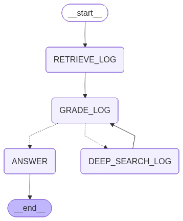

# Error Analyzer RAG

## Overview

Error Analyzer is an AI-powered production log analysis system.

It helps engineers investigate application failures using natural language.

The system stores production error logs in MongoDB Atlas Vector Search. It retrieves the most relevant logs using semantic search.
If the retrieved logs are not sufficient, 
it performs an additional keyword-based search to fetch missing log entries. 
Finally, it generates an answer based on the complete log context.

The goal is to reduce manual log investigation and provide faster root cause analysis.

---

## Features

* Extracts error logs from application log files.
* Stores logs as vector embeddings in MongoDB Atlas.
* Supports semantic search using vector similarity.
* Detects when retrieved logs are insufficient.
* Extracts missing search keywords automatically.
* Performs keyword-based deep search.
* Combines retrieved logs for better context.
* Answers production support questions using an LLM.
* Built with LangGraph for agentic workflow orchestration.

---

# Architecture

The following diagram shows the LangGraph workflow used by Trace Insight.



---

## Workflow

### 1. Retrieve Log

The workflow starts with a semantic search.

The user's question is converted into an embedding.

The vector database returns the most relevant error logs.

---

### 2. Grade Log

The retrieved logs are evaluated.

The grader determines whether they contain enough information to answer the user's question.

If the logs are sufficient, the workflow proceeds to answer generation.

If the logs are not sufficient, the grader extracts missing search keywords.

---

### 3. Deep Search Log

The extracted keywords are used for an additional database search.

This search looks for logs containing the missing identifiers.

Examples include:

* Request ID
* Correlation ID
* Exception name
* Service name
* Error message

The newly retrieved logs are merged with the previous results.

---

### 4. Answer

The final set of logs is passed to the LLM.

The LLM generates a response based only on the available log evidence.

---

## LangGraph Flow

```text
START
   │
   ▼
RETRIEVE_LOG
   │
   ▼
GRADE_LOG
   │
   ├──────────────► ANSWER
   │
   ▼
DEEP_SEARCH_LOG
   │
   ▼
RETRIEVE ADDITIONAL LOGS
   │
   ▼
ANSWER
   │
   ▼
END
```

---

## Technologies

* Python
* LangGraph
* LangChain
* MongoDB Atlas Vector Search
* OpenAI Embeddings
* OpenAI GPT Models
* PyMongo

---

## Project Structure

> This section will describe the project folder structure.

---

## Installation

> Installation steps will be added here.

---

## Configuration

The project uses environment variables for configuration.

Typical configuration includes:

* MongoDB Atlas connection
* Vector Search index
* OpenAI API Key
* Embedding model
* LLM model

---

## Future Improvements

- Improve keyword extraction for more accurate deep log retrieval.
- Integrate the application source code into the knowledge base to enable code-aware root cause analysis.
---
